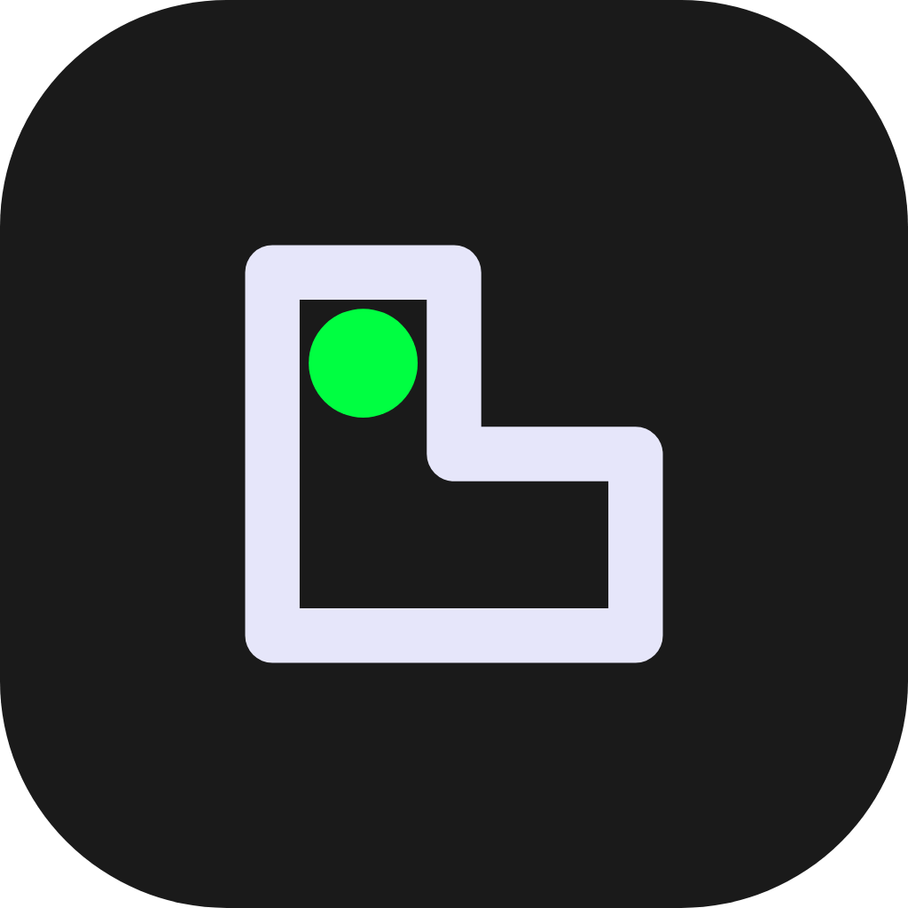

<div align="center">



# Changarro

**Tu negocio, bajo control. Sin complicaciones.**

Una caja registradora digital gratuita, hecha para tiendas de barrio,
fondas, papelerías y cualquier negocio pequeño que quiera llevar el control
de sus ventas sin depender de internet ni pagar suscripciones.

[](https://github.com/bendito-codigo/changarro-app/releases)
[](https://github.com/bendito-codigo/changarro-app/releases)
[](#)
[](./LICENSE)
[](https://benditocodigo.com)

</div>

---

## 🎯 ¿Para quién es Changarro?

Para ti, si:

- 🏪 Tienes una tienda de barrio, abarrotes, papelería, fonda o negocio similar
- 📓 Llevas el control en libreta o directamente en la memoria
- 📵 No tienes internet estable o simplemente no quieres depender de él
- 💸 No quieres pagar una suscripción mensual por un software caro y complicado
- 🔒 Quieres que los datos de tu negocio se queden **en tu teléfono**, no en servidores de terceros

---

## ✨ ¿Qué puedes hacer con Changarro?

| Función | Descripción |
|---|---|
| 🛒 **Registrar ventas** | Toca un producto y se agrega al carrito. Así de fácil |
| ⚡ **Venta rápida** | Cobra algo sin registrarlo en el catálogo |
| 💵 **Calcular cambio** | Ingresa lo que te da el cliente y listo |
| 📦 **Gestionar productos** | Tu catálogo completo con precios y categorías |
| 💰 **Historial de ventas** | Consulta tus ventas por turno, día o mes |
| 🕐 **Turnos de caja** | Organiza las ventas por turno y genera resúmenes de caja |
| 🧾 **IVA automático** | Actívalo cuando lo necesites |
| 💾 **Respaldo de datos** | Exporta e importa todo en un archivo `.json` |
| 📱 **Funciona offline** | Sin internet, sin nubes, sin suscripciones |

---

## 📸 Capturas de pantalla

<div align="center">

| Inicio | Carrito | Ventas |
|:---:|:---:|:---:|
|  |  |  |

| Cobro (Checkout) | Turnos | Ajustes |
|:---:|:---:|:---:|
|  |  |  |

</div>

---

## 📲 Descarga

> **La primera versión pública está en camino.** Mientras tanto puedes compilar la app tú mismo siguiendo la guía de abajo.

Cuando esté disponible, la encontrarás en la sección de [**Releases**](https://github.com/bendito-codigo/changarro-app/releases) de este repositorio:

- 📱 **Android** — archivo `.apk` listo para instalar
- 🖥️ **Windows** — instalador `.exe`
- 🍎 **macOS** — archivo `.dmg`

---

## 🚀 Primeros pasos (instalación desde código fuente)

¿Quieres compilar la app tú mismo o contribuir al proyecto? Necesitas:

**Requisitos previos:**
- [Node.js](https://nodejs.org) v22 o superior
- [Git](https://git-scm.com)
- [Android Studio](https://developer.android.com/studio) (solo para compilar el APK de Android)

**Pasos:**

```bash
# 1. Clona el repositorio
git clone https://github.com/bendito-codigo/changarro-app.git
cd changarro-app

# 2. Instala las dependencias
npm install

# 3. Inicia el modo de desarrollo (versión web)
npm run dev
```

Abre tu navegador en `http://localhost:5173` y ya puedes usar Changarro.

Para compilar el APK de Android, consulta la [guía de entorno de desarrollo](./documentacion/manuales-tecnicos/02-entorno-desarrollo.md).

---

## 📖 Documentación

| Documento | Descripción |
|---|---|
| [📘 Introducción](./documentacion/manuales-usuario/01-introduccion.md) | Qué es Changarro y cómo empezar |
| [🚦 Primeros pasos](./documentacion/manuales-usuario/02-primeros-pasos.md) | Tu primera venta paso a paso |
| [🗺️ Navegación](./documentacion/manuales-usuario/03-navegacion.md) | Guía completa de todas las pantallas |
| [🏗️ Arquitectura](./documentacion/manuales-tecnicos/01-arquitectura.md) | Cómo está construida la app (para desarrolladores) |
| [💻 Entorno de desarrollo](./documentacion/manuales-tecnicos/02-entorno-desarrollo.md) | Cómo configurar tu entorno para contribuir |
| [🗂️ Estructura del código](./documentacion/manuales-tecnicos/03-estructura-codigo.md) | Organización interna del proyecto |

---

## 🛡️ Privacidad y datos

Changarro está diseñado con un principio claro:

> **Tus datos son tuyos. Siempre.**

- ❌ No hay servidor central
- ❌ No hay telemetría ni analytics
- ❌ No necesita cuenta ni correo electrónico
- ✅ Todo se guarda en tu dispositivo
- ✅ Puedes exportar todo en cualquier momento con un solo botón

---

## 🤝 ¿Quieres contribuir?

Changarro es un proyecto de código abierto hecho con cariño por [Bendito Código](https://benditocodigo.com). Toda contribución es bienvenida:

- 🐛 **Reportar bugs** → abre un [Issue](https://github.com/bendito-codigo/changarro-app/issues)
- 💡 **Proponer ideas** → abre un Issue con la etiqueta `enhancement`
- 🔧 **Contribuir código** → lee la [guía de desarrollo](./documentacion/manuales-tecnicos/02-entorno-desarrollo.md) y abre un Pull Request

---

## 🏗️ Stack tecnológico

<div align="center">

[](https://vuejs.org)
[](https://vite.dev)
[](https://tailwindcss.com)
[](https://www.typescriptlang.org)
[](https://capacitorjs.com)
[](https://dexie.org)

</div>

---

## 📄 Licencia

Changarro se distribuye bajo la licencia **PolyForm Noncommercial License 1.0.0**.

Esto significa que puedes:
- ✅ Usarlo libremente para tu negocio o de forma personal
- ✅ Modificarlo y adaptarlo a tus necesidades
- ✅ Compartirlo con otras personas
- ❌ No puedes comercializarlo ni venderlo como producto propio

Consulta el archivo [LICENSE](./LICENSE) para los términos completos.
© 2026 Mauro Nava Luevanos — [benditocodigo.com](https://benditocodigo.com)

---

<div align="center">

Desarrollada con propósito 🫀 por [**Bendito Código**](https://benditocodigo.com)

*Un changarro pa' los changarros* 🏪

</div>